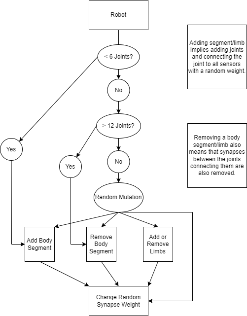
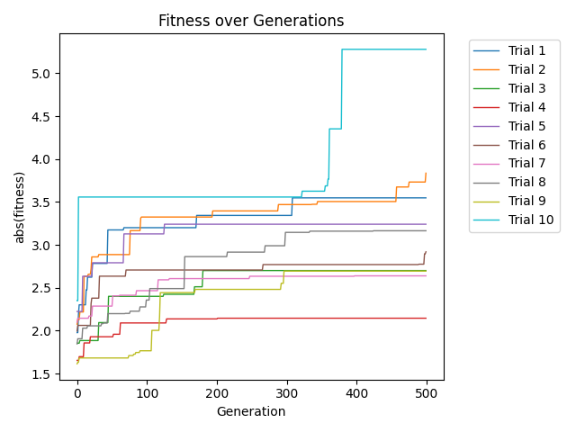

# cs396-ludobots - Assignment 8

This repo is for the Northwestern class COMP_SCI 396: Artificial Life and is based of the Ludobots online course:
https://www.reddit.com/r/ludobots  
https://www.mccormick.northwestern.edu/mechanical/documents/courses/me-495-artificial-life.pdf  

Video: https://youtu.be/8BrbSLRCXb8

This repo is for an assignment for the Northwestern Class CS396 - Artifical Life.

Random creatures are created, and then evolved through random mutations to maximize the distance traveled in the negative x direction. 
The diagram below showcases how the random creatures are created.
The body shapes are limited to rectangular prisms of varying lengths, widths, and heights.
Essentially, starting from a base body segment, there can be random parts added forwards or backwards, with a chance for a small rotation in x or y axes, and even smaller chance for a smaller roation along the z axis.
Each segment has a chance to grow legs to sides. Each leg then also has a chance to grow a second segment, which is rotated along the x-axis. The legs move along the 1 1 0 axis.
Every sensor is connected to every joint, with random weights. 

After being generated, the creature can go several possible mutations with a random chance. The diagram below showcases the possibilities. There is a 1/4 chance the body will be extended, with the same probabilities for size and for having limbs as if it were being generated. There is a 1/4 chance that a body segment will be deleted from one of the ends, including any limbs it had. There is a 1/4 chance of one of the ends of the creature to gain limbs if it didn't have any or lose the limbs if it does. There is a 1/4 chance that no body segments are added or deleted. There is a 100% chance that one of the weights of sensor-joint synapses to be changed to another random value.

The video linked above showcases some of the possibilities of what can arise when the code is ran, as well as some untrained examples. The creatures were trained as parallel hill climbers with a population size of 10 over 100 generations over 1000 timesteps. This was ran 5 times with 5 different seeds, and a graph is included below to showcase the result, showing the best fitness so far at each generation.

To recreate the experiment, run search.py to begin parallel hillclimbing, after which the best brain-body combo will be left. It is important to rename it as all files following the naming convention of the files created during search.py. Alternatively run button.py to see a random, untrained creature. 