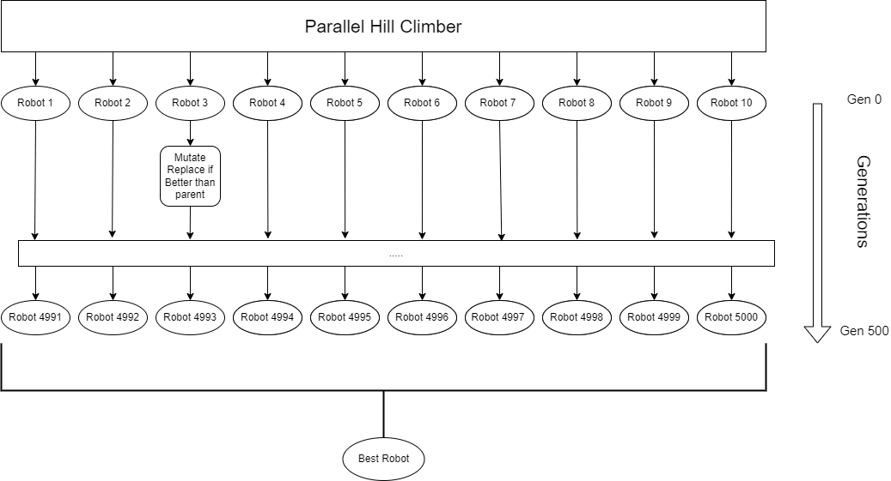
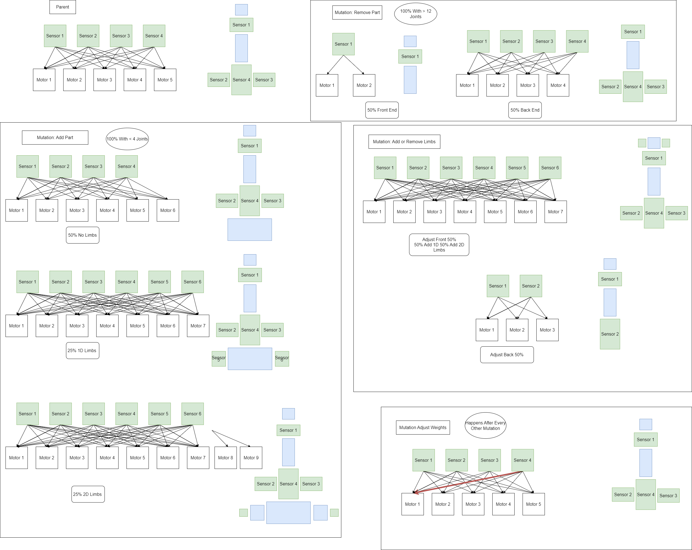

# cs396-ludobots - Final Project (Engineering Route)

This repo is for the Northwestern class COMP_SCI 396: Artificial Life and is based of the Ludobots online course:  
https://www.reddit.com/r/ludobots  
https://www.mccormick.northwestern.edu/mechanical/documents/courses/me-495-artificial-life.pdf  

Video: https://youtu.be/8BrbSLRCXb8

## What is this?

This repo is for the final project for the class COMP_SCI 396: Artificial Life, taught by Professor Sam Kriegman. Creatures are randomly generated, then mutated over multiple generations to become optimized for a specified task. The evolutionary algorithm selects the best children. The end result is a completely random creature specified to do the designated task, with no input from a human. Below is a quick showcase of the possible results of this project.

# Methods

## Task
The creature is measured by a fitness function of the distance traveled in the negative x direction.

## Parallel Hill Climbing
Over 500 generations, 10 random bots will be created. After each generation, each robot is mutated. If the child has a better fitness, the child replaces the parent. Otherwise, the original parent is mutated again for the next generation.
The Diagram below showcases the process.

## Design Space
Essentially, starting from a base body segment, there can be random parts added forwards or backwards, with a chance for a small rotation in x or y axes, and even smaller chance for a smaller roation along the z axis.
Each segment has a chance to grow legs to sides. Each leg then also has a chance to grow a second segment, which is rotated along the x-axis. The legs move along the 1 1 0 axis.
Every sensor is connected to every joint, with random weights. 
The body parts are limited to rectangular prisms of varying lengths, widths, and heights.
The diagram below showcases how the random creatures are created.

## Brain
The brain is connected of randomly chosen sensors, each part has a 1/3 chance to be a sensor when generated. Ends of limbs have a 100% chance to be a sensor. Every sensor is connected to every motor. Body parts that are sensors are colored green, and it is guarenteed to be at least one sensor. The diagram showcases a possible example.

## Mutations
After being generated, the creature can go several possible mutations with a random chance. The diagram below showcases the possibilities. There is a 1/4 chance the body will be extended, with the same probabilities for size and for having limbs as if it were being generated. There is a 1/4 chance that a body segment will be deleted from one of the ends, including any limbs it had. There is a 1/4 chance of one of the ends of the creature to gain limbs if it didn't have any or lose the limbs if it does. There is a 1/4 chance that no body segments are added or deleted. There is a 100% chance that one of the weights of sensor-joint synapses to be changed to another random value.

The diagram belows the possibilities for which the body can be mutated.

The diagram below gives examples of how changes can be made to a body.

## How To Run

To parallel hill climb:  
"py search.py"

To view 10 best results from 50,000 simulations:  
"py showcase.py"  
(Note that simulations after the first may not pop into top of desktop and may be buried by other windows open.)

To view a random, untrained creature:  
"py button.py"

To view a creature evolve for a 500 generations, showcasing mutations that evolve it:  
"py hillclimb.py"

## Results

The video linked above showcases some of the possibilities of what can arise when the code is ran, as well as some untrained examples. The creatures were trained as parallel hill climbers with a population size of 10 over 100 generations over 1000 timesteps. This was ran 10 times with 10 different seeds, and a graph is included below to showcase the result, showing the best fitness so far at each generation.

### Limitations and Room for Improvement

